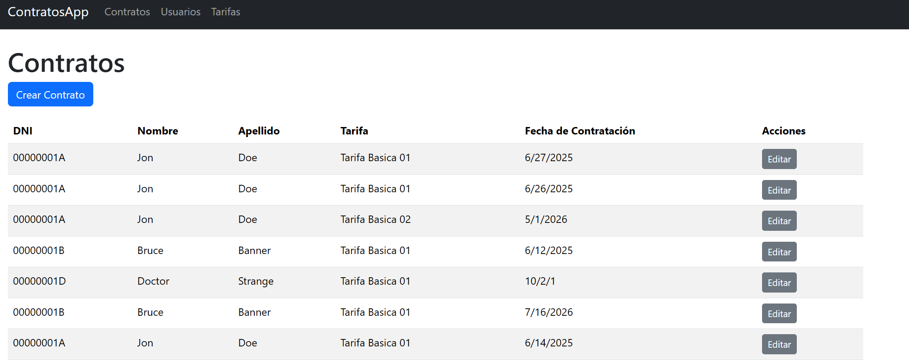
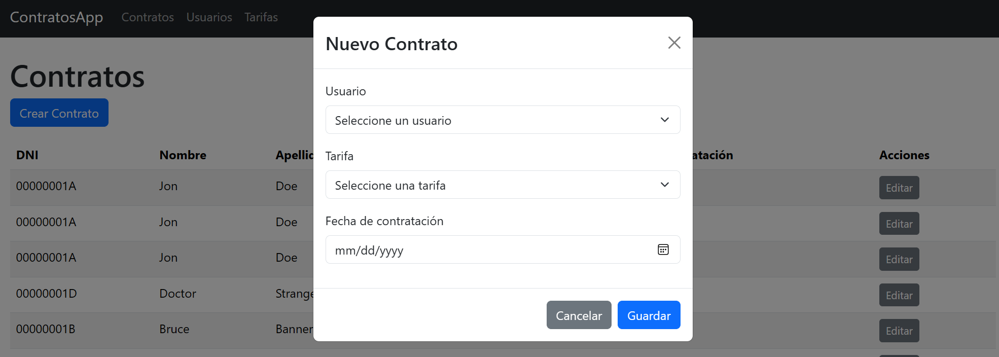
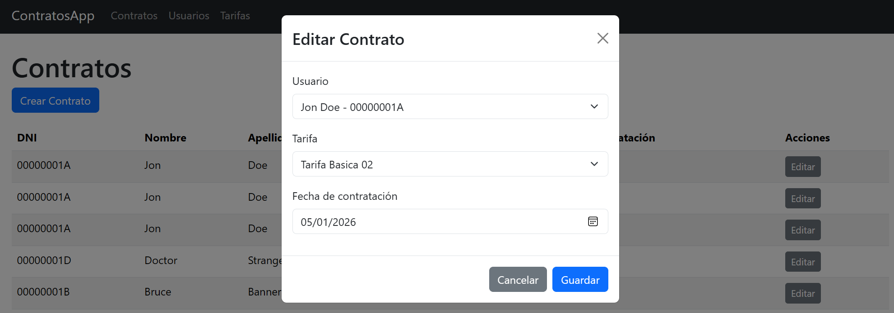
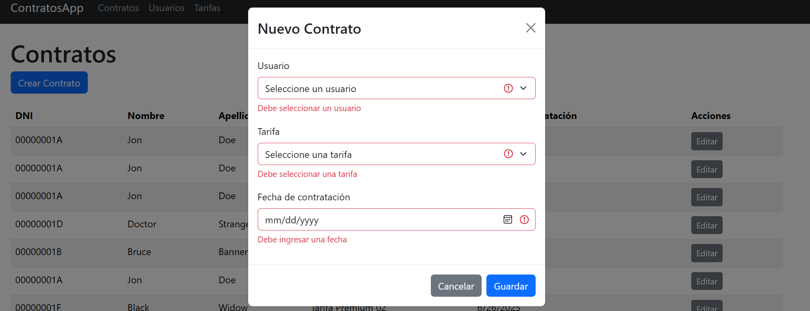
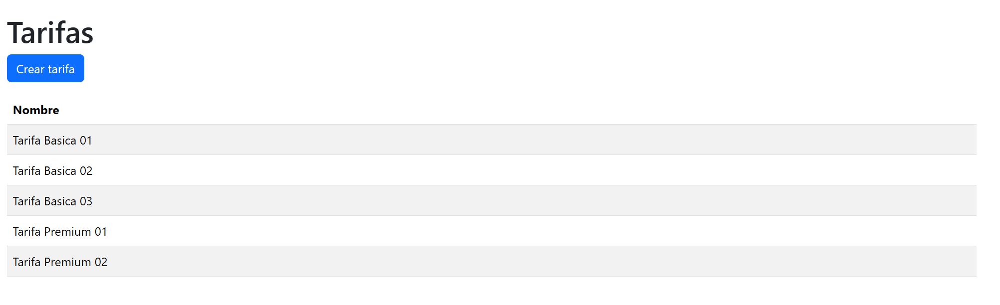
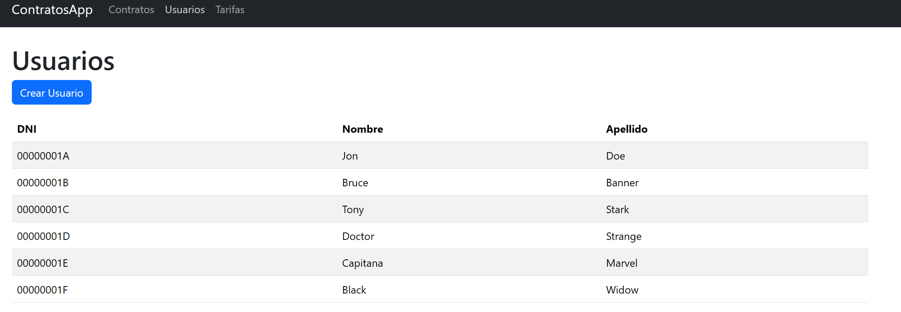
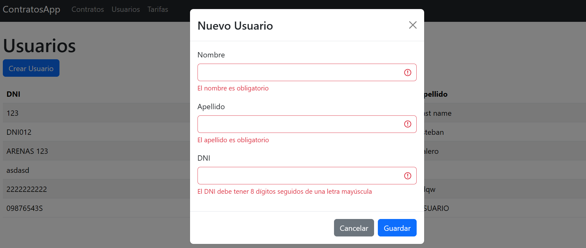

# Manejo de contratos

## Forma de ejecución
 
Lo primero es crear la base de datos, para esto es necesario ejecutar `docker-compose up -d database` con esto, se creará el contenedor de postgresql y se creará la base de datos con datos básicos.

Después de esto, es necesario ejecutar los dos proyectos en paralelo:

- Desde la carpeta `.\frontend\energy.app` se debe ejecutar el comando `npm install` y luego ejecutar `npm run dev`.
El proyecto se ejecutará en la dirección [app](http://localhost:5173/)

- Desde la carpeta `.\backend\Energy.Api` se debe ejecutar el comando `dotnet restore` luego para ejecutar el proyecto `dotnet run --project .\src\Host\Energy.Host.csproj`.
Finalmente, el proyecto se ejecutará y expondrá un swagger al que se puede acceder desde la dirección [swagger](http://localhost:5073/swagger/index.html)

## Visualización del front

- Listado de contratos existentes

- Modal de nuevo contrato

- Modal de edición de contrato

- Validación de campos en el modal de contratos

- Listado de tarifas

- Listado de usuarios

- Modal nuevo usuario con su validación
